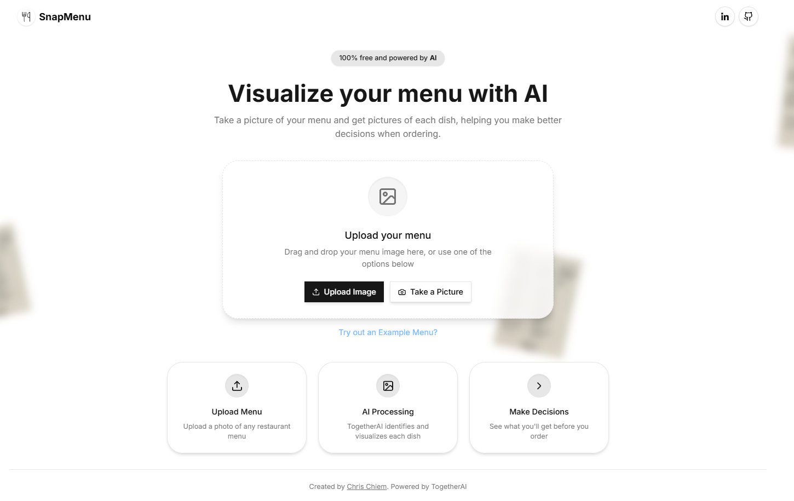

# AI Menu Visualizer



A web app that generates high-quality AI images for restaurant menu items from a simple photo of the menu.

## 🚀 Features

-   📸 Upload an image of a restaurant menu
-   🔍 Extract menu items using **Llama 3.2 Vision 90B** (Together AI)
-   📄 Convert extracted text into structured JSON using **Llama 3.1 8B** (Together AI)
-   🎨 Generate realistic dish images with **Flux Schnell** (Together AI)
-   ☁️ Store generated images securely in **AWS S3**
-   🌐 Built with **Next.js (TypeScript), Shadcn, and Tailwind CSS** for a modern UI

## 🛠 Tech Stack

-   **Frontend:** React, Next.js, TypeScript, Shadcn, Tailwind CSS
-   **AI Models:** Llama 3.2 Vision 90B, Llama 3.1 8B, Flux Schnell (Together AI)
-   **Storage:** AWS S3 for image storage
-   **Backend:** Next.js API routes (for AI requests & S3 integration)
-   **Hosting:** Vercel

## 📸 Demo


## 🔧 Installation

1. Clone the repository:

    ```bash
    git clone https://github.com/yourusername/ai-menu-visualizer.git
    cd ai-menu-visualizer
    ```

2. Install dependencies:

    ```bash
    npm install
    ```

3. Set up AWS S3:

    - Create an **S3 bucket** on AWS.
    - Configure permissions for public access (or private with signed URLs).
    - Get your **AWS Access Key ID** and **Secret Access Key**.

4. Create a `.env.local` file and add your API keys:

    ```env
    TOGETHER_AI_API_KEY=your_api_key
    AWS_ACCESS_KEY_ID=your_aws_access_key
    AWS_SECRET_ACCESS_KEY=your_aws_secret_key
    AWS_S3_BUCKET_NAME=your_bucket_name
    AWS_REGION=your_aws_region
    ```

5. Start the development server:

    ```bash
    npm run dev
    ```

6. Open `http://localhost:3000` in your browser.

## 📜 Usage

1. Upload an image of a restaurant menu.
2. The app extracts menu items and converts them into structured JSON.
3. AI generates high-quality images for each dish.
4. Generated images are stored in **AWS S3**.
5. View, share, or download the AI-generated images.

## ☁️ AWS S3 Integration

-   **Uploading Images:** The app uploads generated images to S3 using AWS SDK.
-   **Retrieving Images:** The frontend fetches images via **pre-signed URLs** for security.
-   **Storage Strategy:** Each menu gets a unique folder inside the S3 bucket.
